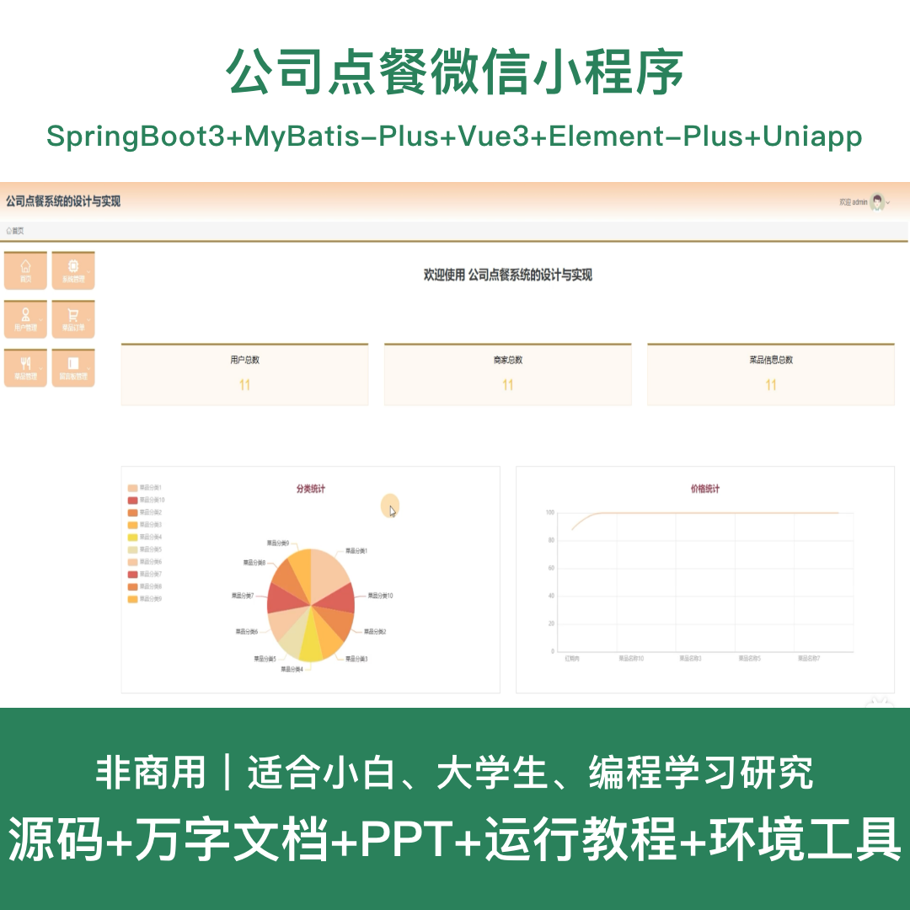
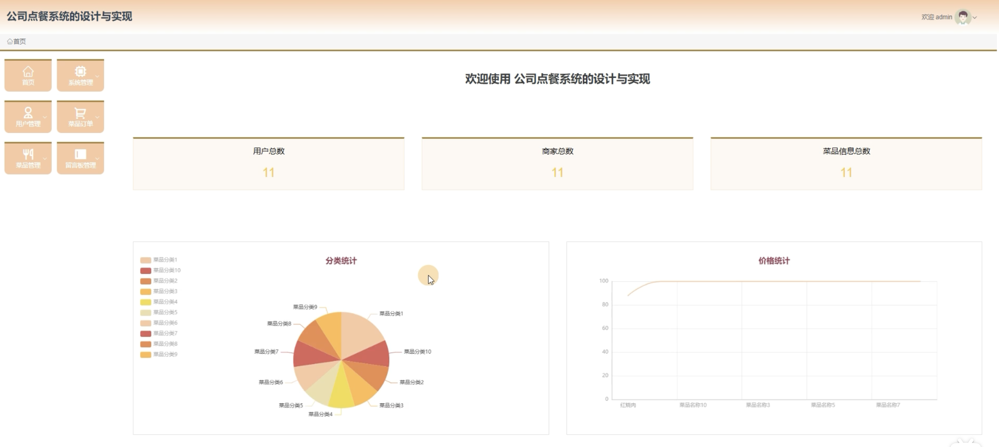
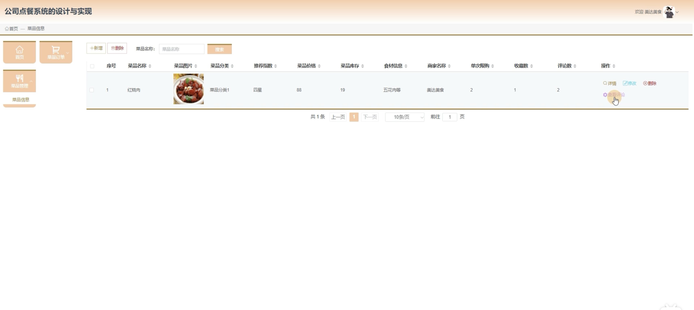
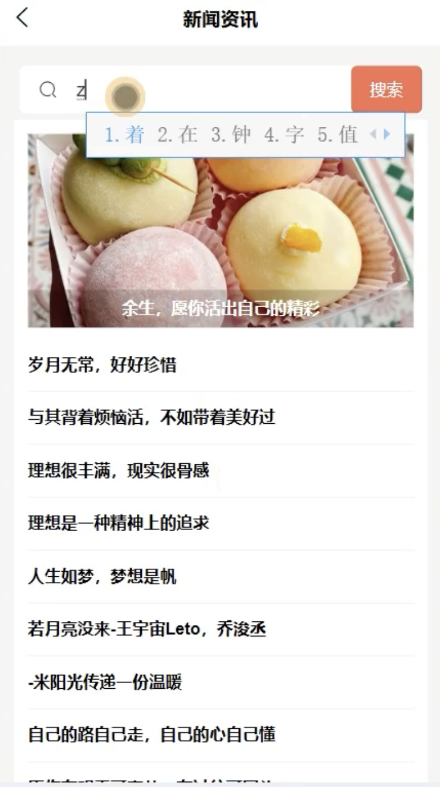
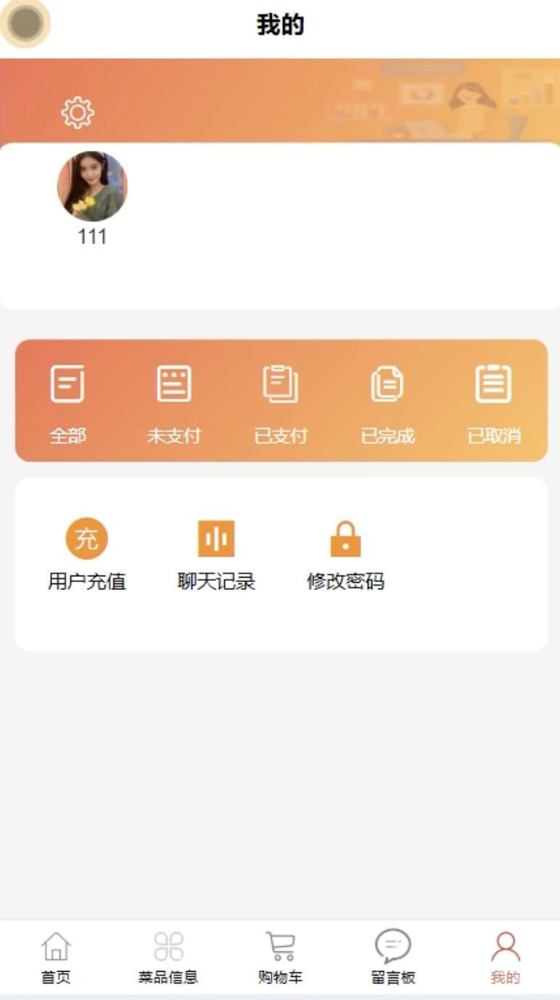
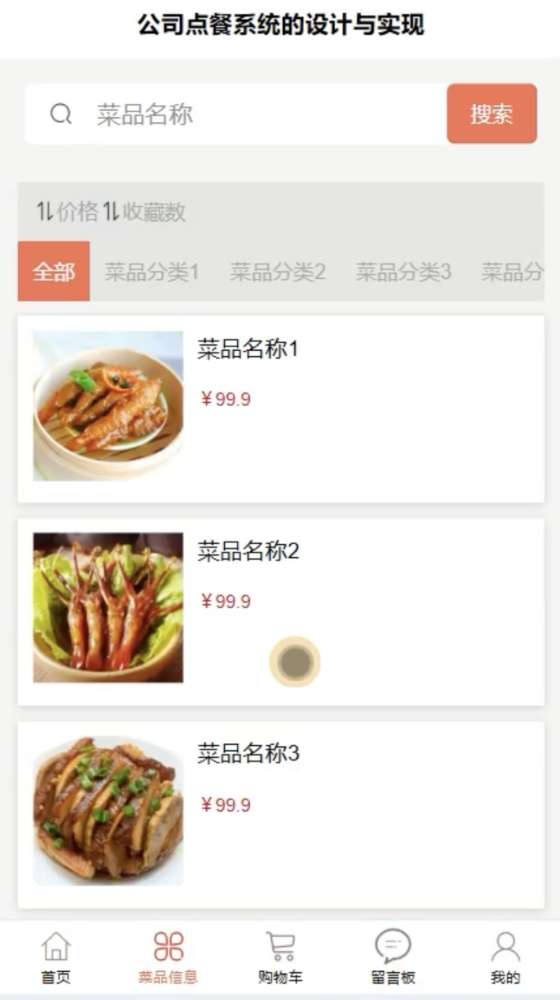
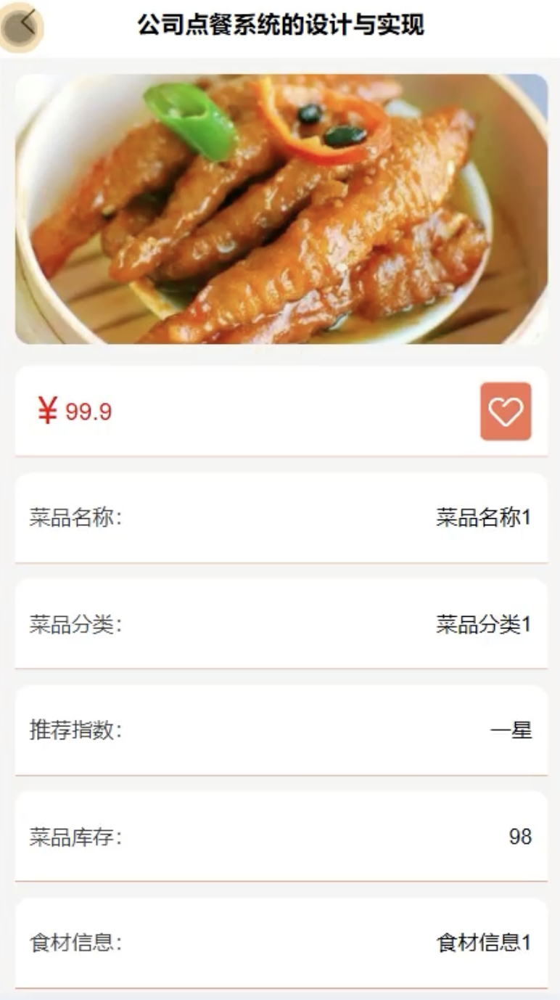
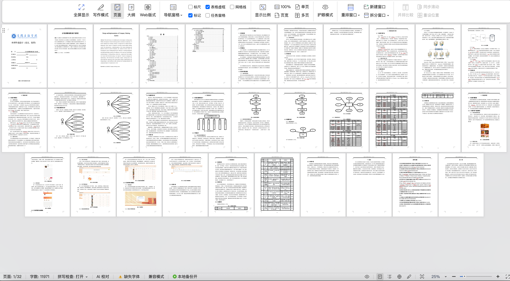

# mpweixinA237D
mpweixinA237D公司点餐微信小程序+LW+PPT
 
## 源码问题查看主页咨询

### 一、关键词
公司点餐系统、企业点餐系统、职工订餐系统、单位餐饮系统、食堂订餐系统

### 二、作品包含
源码+数据库+万字设计文档+PPT+全套环境和工具资源+本地部署教程

### 三、项目技术
前端技术： Html、Css、Js、Vue3.2、Element-Plus、uniapp
后端技术：Java、SpringBoot3.3.0、MyBatis-Plus

### 四、运行环境（以下版本亲测，其他版本兼容性请自行测试）
开发工具：IDEA/eclipse + VSCODE + HBuilder X + 微信开发者工具

数据库：MySQL 8.0+

数据库管理工具：Navicat10以上版本

环境配置软件： JDK17 + Maven3.6+

前端Nodejs：16+

浏览器：谷歌浏览器

### 五、项目介绍
项目编号：mpweixinA237D

基于微信小程序的公司点餐系统，为企业提供便捷的订餐服务，实现菜品展示、在线点餐、订单管理等功能，方便职工就餐，提升餐饮管理效率。

角色：管理员、用户、商家

用户功能：注册登录、浏览菜品、菜品分类、在线点餐、订单管理、评价评论、收藏菜品、个人中心。

商家功能：登录、菜品发布、菜品管理、订单处理、评价查看、销售统计。

管理员功能：登录、用户管理、商家管理、菜品管理、订单管理、菜品分类管理、评论管理、系统配置。

数据库表：共17张表

### 六、运行截图

